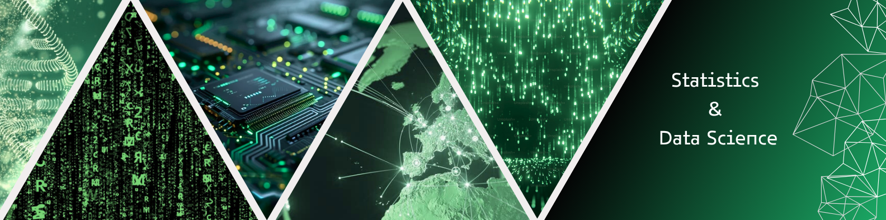

<!-- ENCABEZADO -->

  <!-- Nombre + gif -->
  <h1 align="center" style="margin-bottom: -15px;">
    <b>Hi everyone, I'm Adrián Sánchez</b>
    
  </h1>

  <!-- Typing SVG -->
  

    
  

  <!-- Banner principal -->
  

<!-- Línea divisoria -->
 
 

<!-- SOBRE MÍ -->

<h2>
  
  About Me
</h2>

<ul>
  <li>🏀 <b>Sports & Lifestyle:</b>
    <ul>
      <li>Basketball & Volleyball player – I love team sports and staying active.</li>
      <li>Photography & Nature – Capturing moments and exploring landscapes.</li>
      <li>Travel & Cultures – Enjoy discovering new places and learning about different traditions.</li>
    </ul>
  </li>

   

  <li>🎓 <b>Professional Path:</b>
    <ul>
      <li>Graduated in <b>Statistics</b> from the University of Granada.</li>
      <li>Currently pursuing a Master’s in <b>Data Science & Computer Engineering</b>.</li>
      <li>Gained experience in <b>hospitality, agriculture, and education</b> through various jobs and volunteer programs.</li>
      <li>Open to <b>internships or new job opportunities</b> → <a href="resources/documents/Adrian Sanchez Carrion&apos;s Curriculum Vitae.pdf" target="_blank" style="text-decoration: underline; color: #1CB698;">My Resume</a>.</li>
    </ul>
  </li>

   

  <li>🌐 <b>Portfolio & Networking:</b>
    <ul>
      <li>Check my <b>personal portfolio</b> → <a href="https://adrichez.github.io/english-portfolio/" target="_blank" style="text-decoration: underline; color: #1CB698;">Portfolio</a>.</li>
      <li>GitHub projects & repositories → <a href="https://github.com/adrichez" target="_blank" style="text-decoration: underline; color: #1CB698;">Repositories</a>.</li>
      <li>Always open to <b>connect, collaborate, and share knowledge</b> with others.</li>
    </ul>
  </li>
</ul>

<!-- Línea divisoria -->
 
 

<!-- MÁS DETALLES -->

<h2>
  
  In more detail
</h2>

Hi everyone! 👋

I'm a 24-year-old from Beas de Segura, a small town in Jaén 🌳. I've always been fascinated by how things work, exploring new ideas, and connecting with others. I love learning and travelling to gain new experiences. Over the years, I've kept myself busy balancing work and studies, gaining experience in hospitality, agriculture, and education 🍽️.

During my first year of high school, I took part in a Cultural Exchange Program in Brighton, England 🇬🇧, which was an enriching adventure that fueled my passion for more experiences like it.

In 2019, I began my degree in Statistics at the University of Granada 🎓, driven by my love for science, particularly mathematics, computer science, and economics. In the 2021/2022 academic year, I joined the Erasmus+ program at the Università degli Studi di Padova in Italy 🇮🇹. This unforgettable experience, the country, and the people helped me grow personally and create lasting memories 🌍.

In 2023, after years of hard work, I was honored to be selected among the top 20 students at the University of Granada for the UGR Talent Incubator’s Professional Skills Acceleration Program 🎖️. This program, which focused on soft skills, coaching, mentoring, teamwork, and sustainable development, was the perfect end to my university journey.

After the global situation left me feeling disconnected, I decided to take a "gap" year in 2023/2024. I wanted to reconnect with people 🤲 and explore new paths on my own. Thanks to the University of Malaga, the European Solidarity Corps, and self-study, I spent the year volunteering, taking courses, and working in different countries. During this time, I gained new skills, built meaningful relationships, and grew more confident in several languages 🇪🇺.

In 2024/2025, I’m back at the University of Granada, pursuing a Master’s in Data Science and Computer Engineering 👨🏻‍💻🧬. Currently, I’m working as a bioinformatician while carrying out my Master’s thesis (TFM) at the <strong>Instituto de Parasitología y Biomedicina López-Neyra</strong> in Granada 🧫. This experience allows me to combine my passion for data science with cutting-edge research in biology and medicine, gaining hands-on expertise in bioinformatics and computational analysis.

<!-- Línea divisoria -->
 
 

<!-- LENGUAJES DE PROGRAMACIÓN Y HERRAMIENTAS -->

<h2>
  
  Languages and Tools
</h2>

<h3 align="center">
  🧠 Programming & Data Science
</h3>

  <!-- Programming & Data Science -->
  &nbsp;<!--
  -->&nbsp;<!--
  -->&nbsp;<!--
  -->&nbsp;<!--
  -->&nbsp;<!--
  -->&nbsp;<!--
  -->&nbsp;<!--
  -->&nbsp;<!--
  -->&nbsp;<!--
  -->&nbsp;<!--
  -->&nbsp;<!--
  -->&nbsp;<!--
  -->&nbsp;<!--
  -->&nbsp;<!--
  -->&nbsp;<!--
  -->&nbsp;<!--
  -->

<h3 align="center">
  🌐 Web Development
</h3>

  <!-- Web Development -->
  &nbsp;<!--
  -->&nbsp;<!--
  -->&nbsp;<!--
  -->

<h3 align="center">
  🛠️ Tools & Technologies
</h3>

  <!-- Tools -->
  &nbsp;<!--
  -->&nbsp;<!--
  -->&nbsp;<!--
  -->&nbsp;<!--
  -->&nbsp;<!--
  -->&nbsp;<!--
  -->&nbsp;<!--
  -->&nbsp;<!--
  -->&nbsp;<!--
  -->&nbsp;<!--
  -->&nbsp;<!--
  -->

<h3 align="center">
  🎨 Photography & Video
</h3>

  <!-- Photography & Video -->
  &nbsp;<!--
  -->&nbsp;<!--
  -->&nbsp;<!--
  -->

<h3 align="center">
  🏛️ Architecture & Design
</h3>

  <!-- Architecture & Design -->
  &nbsp;<!--
  -->&nbsp;<!--
  -->

  And more... always learning! 📚

<!-- Línea divisoria -->
 
 

<!-- ESTADÍSTICAS DE GITHUB -->

<h2>
  
  My GitHub Stats
</h2>

  Here’s an overview of my coding activity and top languages on GitHub. 📈

 

<table align="center" border="0" cellpadding="0" cellspacing="0">
  <tr>
    <!-- Columna izquierda -->
    <td valign="top">
      
    </td>
    <!-- Columna derecha -->
    <td valign="top">
      
       
       
      
      

    </td>
  </tr>
  <!-- Fila inferior: Trophies -->
  <tr>
    <td colspan="2" align="center">
       
      
    </td>
  </tr>
</table>

<!-- Línea divisoria -->
 
 

<!-- CONTACTO -->

<h2>
  
  Contact
</h2>

  
  
  
  
  
  
  

