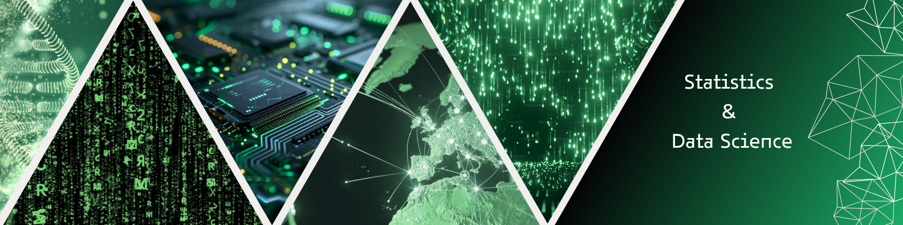
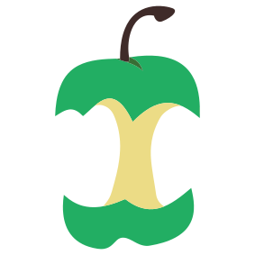

<!-- ENCABEZADO -->

  <!-- Nombre + gif -->
  <h1 align="center" style="margin-bottom: -15px;">
    <b>Hi everyone, I'm Adrián Sánchez</b>
    
  </h1>

  <!-- Typing SVG -->
  

    
  

  <!-- Banner principal -->
  

<!-- Línea divisoria -->
 
 

<!-- SOBRE MÍ -->

<h2>
  
  About Me
</h2>

<ul>
  <li>🏀 <b>Sports & Lifestyle:</b>
    <ul>
      <li>Basketball & Volleyball player – I love team sports and staying active.</li>
      <li>Photography & Nature – Capturing moments and exploring landscapes.</li>
      <li>Travel & Cultures – Enjoy discovering new places and learning about different traditions.</li>
    </ul>
  </li>

   

  <li>🎓 <b>Professional Path:</b>
    <ul>
      <li>Hold a <b>BSc in Statistics</b> and an <b>MSc in Data Science and Computer Engineering</b> from the University of Granada.</li>
      <li>Currently pursuing a <b>PhD in Information and Communication Technologies</b>, specializing in Data Mining, at the University of Granada.</li>
      <li>Working as a <b>PhD Researcher in Data Science and Heritage</b> at IGEO-CSIC/CENIM-CSIC, developing Machine Learning, Computer Vision, and predictive models for cultural heritage research.</li>
      <li>Gained experience as a <b>Bioinformatics Developer</b> at IPBLN-CSIC, automating workflows and developing intelligent data analysis solutions and working as an <b>R&D&I Tech Specialist</b> at the Institute of Mathematics (IMAG).</li>
      <li>Backed by a diverse background spanning <b>international volunteering, education, and scientific research</b>.</li>
      <li>Open to <b>research collaborations and professional opportunities</b> → <a href="resources/documents/Adrian Sanchez Carrion&apos;s Curriculum Vitae.pdf" target="_blank" style="text-decoration: underline; color: #1CB698;">My Resume</a>.</li>
    </ul>
  </li>

   

  <li>🌐 <b>Portfolio & Networking:</b>
    <ul>
      <li>Check my <b>personal portfolio</b> → <a href="https://adrichez.github.io/english-portfolio/" target="_blank" style="text-decoration: underline; color: #1CB698;">Portfolio</a>.</li>
      <li>GitHub projects & repositories → <a href="https://github.com/adrichez" target="_blank" style="text-decoration: underline; color: #1CB698;">Repositories</a>.</li>
      <li>Always open to <b>connect, collaborate, and share knowledge</b> with others.</li>
    </ul>
  </li>
</ul>

<!-- Línea divisoria -->
 
 

<!-- MÁS DETALLES -->

<h2>
  
  In more detail
</h2>

I am a Data Scientist and PhD Researcher from Beas de Segura (Jaén, Spain) 📍. I am passionate about analyzing data to solve complex problems, continuous learning, and collaborating in multidisciplinary environments.

I hold a Bachelor's degree in Statistics from the University of Granada 🎓 (including an Erasmus+ stay at the Università di Padova 🇮🇹 and professional training at the UGR Talent Incubator). Following an international volunteering experience with the European Solidarity Corps 🌍, I pursued a Master's degree in Data Science and Computer Engineering, where I developed GenoScribe, an intelligent system for automated bioinformatics reporting 💻.

After roles as a Bioinformatics Developer (CSIC-IPBLN) and R&D&I Tech Specialist (IMAG-UGR), I am currently pursuing a PhD in Information and Communication Technologies, specializing in Data Mining, at the University of Granada, while conducting my research at the Geosciences Institute (IGEO, CSIC-UCM) and CENIM (CSIC) in Madrid. My research within the TEC Heritage-CM project focuses on developing Machine Learning, Computer Vision, and predictive models to analyze large volumes of experimental data and preserve cultural heritage.

I am always open to connecting, sharing ideas, and collaborating on projects related to data science, artificial intelligence, and scientific research 🤝.

<!-- Línea divisoria -->
 
 

<!-- LENGUAJES DE PROGRAMACIÓN Y HERRAMIENTAS -->

<h2>
  
  Languages and Tools
</h2>

<h3 align="center">
  🧠 Programming & Data Science
</h3>

  <!-- Programming & Data Science -->
  &nbsp;<!--
  -->&nbsp;<!--
  -->&nbsp;<!--
  -->&nbsp;<!--
  -->&nbsp;<!--
  -->&nbsp;<!--
  -->&nbsp;<!--
  -->&nbsp;<!--
  -->&nbsp;<!--
  -->&nbsp;<!--
  -->&nbsp;<!--
  -->&nbsp;<!--
  -->&nbsp;<!--
  -->&nbsp;<!--
  -->&nbsp;<!--
  -->&nbsp;<!--
  -->&nbsp;<!--
  -->

<h3 align="center">
  🌐 Web Development
</h3>

  <!-- Web Development -->
  &nbsp;<!--
  -->&nbsp;<!--
  -->&nbsp;<!--
  -->

<h3 align="center">
  🛠️ Tools & Technologies
</h3>

  <!-- Tools -->
  &nbsp;<!--
  -->&nbsp;<!--
  -->&nbsp;<!--
  -->&nbsp;<!--
  -->&nbsp;<!--
  -->&nbsp;<!--
  -->&nbsp;<!--
  -->&nbsp;<!--
  -->&nbsp;<!--
  -->&nbsp;<!--
  -->&nbsp;<!--
  -->

<h3 align="center">
  🎨 Photography & Video
</h3>

  <!-- Photography & Video -->
  &nbsp;<!--
  -->&nbsp;<!--
  -->&nbsp;<!--
  -->

<h3 align="center">
  🏛️ Architecture & Design
</h3>

  <!-- Architecture & Design -->
  &nbsp;<!--
  -->&nbsp;<!--
  -->

  And more... always learning! 📚

<!-- Línea divisoria -->
 
 

<!-- ESTADÍSTICAS DE GITHUB -->

<h2>
  
  My GitHub Stats
</h2>

  Here’s an overview of my coding activity and top languages on GitHub. 📈

 

  

<!-- Línea divisoria -->
 
 

<!-- CONTACTO -->

<h2>
  
  Contact
</h2>

  
  
  
  
  
  
  

